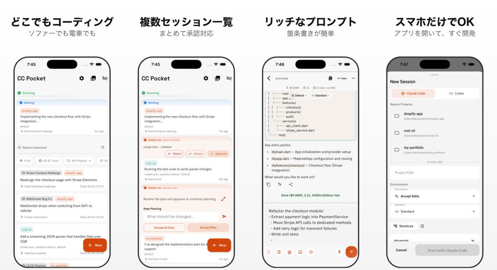

# ccpocket

Claude Code / Codex対応モバイルクライアント。Bridge Server経由でコーディングエージェントをiPhone/Androidから操作できます。

[English README](README.md)

<p align="center">
  
</p>

## 主な機能

- **スマホからセッション開始** — デスクトップ不要。モバイルから直接コーディングセッションを起動
- **まとめて承認** — 複数セッションの承認リクエストを一覧で確認し、一括で対応
- **モバイル最適化UI** — タッチ操作に最適化されたUIで、質問への回答やツール承認を素早く処理
- **リッチなプロンプト** — Markdown記法・箇条書きの自動補完・クリップボードや写真からの画像添付に対応
- **セッション整理** — セッションに名前を付け、プロジェクトごとに整理して素早くアクセス
- **差分ビューア** — コード変更をシンタックスハイライト付きのdiffで一覧レビュー
- **リアルタイムストリーミング** — エージェントの思考とコーディングをライブで確認
- **プッシュ通知** — 承認リクエストやタスク完了を即座に通知
- **マシン管理** — 複数マシンの登録・ステータス監視・SSH経由のリモート起動/停止
- **柔軟な接続** — 保存済みマシン・QRコード・mDNS自動発見・手動入力

## 前提条件

- [Node.js](https://nodejs.org/) v18以上
- [Claude Code CLI](https://docs.anthropic.com/en/docs/claude-code) および/または [Codex CLI](https://github.com/openai/codex)

## クイックスタート

### 1. Bridge Serverを起動

```bash
# npxで即実行 (インストール不要)
npx @ccpocket/bridge@latest

# またはグローバルインストール
npm install -g @ccpocket/bridge
ccpocket-bridge
```

デフォルトで `ws://0.0.0.0:8765` で起動します。起動時にQRコードがターミナルに表示されます。

### 2. アプリをインストール

<a href="https://play.google.com/store/apps/details?id=com.k9i.ccpocket">
  
</a>

iOS: 準備中

### 3. 接続

| 方法 | 説明 |
|------|------|
| **保存済みマシン** (推奨) | 登録済みマシンにワンタップで接続。ステータス自動表示・ピン留め対応 |
| **QRコード** | ターミナルに表示されるQRをスキャン。URLとAPIキーが自動入力される |
| **mDNS自動発見** | 同一ネットワーク上のBridge Serverを自動検出 (サービスタイプ: `_ccpocket._tcp`) |
| **手動入力** | URLを直接入力 (`ws://192.168.1.5:8765` または `192.168.1.5:8765`) |

ディープリンク: `ccpocket://connect?url=ws://IP:PORT&token=API_KEY`

### 4. セッション操作

**新規セッション**: 「+」ボタンからプロジェクトを選択し、パーミッションモードを設定して開始。

| パーミッションモード | 説明 |
|---------------------|------|
| Accept Edits | ファイル編集は自動承認、その他は確認 (デフォルト) |
| Plan Only | すべて承認が必要 |
| Bypass All / Don't Ask | すべて自動承認 |
| Delegate | サブエージェントへの委任を許可 |

オプションで **Worktree** を有効にすると、git worktreeでブランチを分離して開発できます。

**Resume**: ホーム画面の「Recent Sessions」から過去セッションをタップして再開。プロジェクトフィルタや検索で絞り込み可能。

**ツール承認**: パーミッションモードに応じて承認リクエストが表示されます。ツール名と入力内容を確認し、Approve / Reject を選択してください。

## マシン管理とSSHリモート操作

接続画面の「Add Machine」からマシンを登録します。

| 項目 | 説明 |
|------|------|
| Name | 表示名 (省略時はhost:port) |
| Host | IPアドレスまたはホスト名 |
| Port | Bridge Serverのポート (デフォルト: 8765) |
| API Key | Bridge ServerのAPIキー (任意) |
| SSH | SSHリモート操作の有効化 (ユーザー名・ポート・認証方式を設定) |

SSHを有効にすると、マシンカードのメニューから以下の操作が可能になります。

| 操作 | 説明 |
|------|------|
| **Start** | `launchctl start` でBridge Serverを起動 |
| **Stop Server** | `launchctl stop` でBridge Serverを停止 |
| **Update Bridge** | `git pull` → ビルド → サービス再起動を一括実行 |

> **前提**: リモートマシンはmacOS (launchd対応) で、`npm run setup` によりlaunchdサービスが登録済みであること。

## リモートアクセス (Tailscale)

Mac・iPhoneに[Tailscale](https://tailscale.com/)をインストールし同じネットワークに参加すると、外出先からも接続できます。アプリのServer URLに `ws://<MacのTailscale IP>:8765` を入力してください。

### launchd永続化

Bridge Serverをlaunchdで常駐させると、SSH経由のStart/Stopが可能になります。

```bash
npm run setup                                    # 自動セットアップ
npm run setup -- --port 9000 --api-key YOUR_KEY  # ポート・APIキー指定
npm run setup -- --uninstall                     # アンインストール
```

## macOSホスト設定 (常時稼働Mac向け)

Bridge Serverを常時稼働のMac (Mac mini等) で運用する場合、スクリーンショット機能のために追加設定が必要です。

### 画面収録権限 (必須)

Bridge Serverを起動するターミナルアプリに**画面収録**権限を付与してください。権限がない場合、`screencapture`はエラーなく真っ黒な画像を返します。

> システム設定 → プライバシーとセキュリティ → 画面収録 → ターミナルアプリを追加

権限変更後はターミナルアプリの再起動が必要です。

### ディスプレイ常時ON・自動ロック無効化 (推奨)

ディスプレイがスリープまたはロックされると、ウィンドウIDが無効化されキャプチャが失敗します。
macOSではロック中のウィンドウバッファへのアクセスが不可能なため、ホスト側の設定で回避します。

```bash
# ディスプレイ・システムのスリープを無効化
sudo pmset -a displaysleep 0 sleep 0
```

| 設定 | 場所 | 値 |
|------|------|-----|
| 自動ロック | システム設定 → ロック画面 | **しない** |
| スクリーンセーバ | システム設定 → スクリーンセーバ | **開始しない** |

手動ロック (Ctrl+Cmd+Q) は引き続き使用可能。物理セキュリティが必要な場合はFileVaultの有効化を推奨。

---

## 開発者向け

### アーキテクチャ

```
┌─────────────┐     WebSocket      ┌────────────────┐     stdio      ┌──────────────┐
│  Flutter App │ ◄──────────────► │  Bridge Server  │ ◄────────────► │  Claude CLI   │
│  (iOS/Android)│                   │  (TypeScript)   │                │              │
└─────────────┘                    └────────────────┘                └──────────────┘
```

| 層 | 技術 |
|---|---|
| Mobile App | Flutter / Dart |
| Bridge Server | TypeScript / Node.js / ws |
| パッケージ管理 | npm workspaces |

### ソースからビルド

```bash
git clone https://github.com/K9i-0/ccpocket.git
cd ccpocket
npm install
cd apps/mobile && flutter pub get && cd ../..
```

### 開発コマンド

| コマンド | 説明 |
|---------|------|
| `npm run bridge` | Bridge Server起動 (開発モード) |
| `npm run bridge:build` | Bridge Serverビルド |
| `npm run dev` | Bridge + Flutter一括起動 |
| `npm run dev -- <device>` | デバイス指定付き一括起動 |
| `npm run setup` | launchdサービス登録 |
| `npm run test:bridge` | Bridge Serverテスト |
| `cd apps/mobile && flutter test` | Flutterテスト |
| `cd apps/mobile && dart analyze` | Dart静的解析 |

### 環境変数

| 変数 | デフォルト | 説明 |
|------|-----------|------|
| `BRIDGE_PORT` | `8765` | WebSocketポート |
| `BRIDGE_HOST` | `0.0.0.0` | バインドアドレス |
| `BRIDGE_API_KEY` | (なし) | APIキー認証 (設定時に有効化) |

## ライセンス

[MIT](LICENSE)
