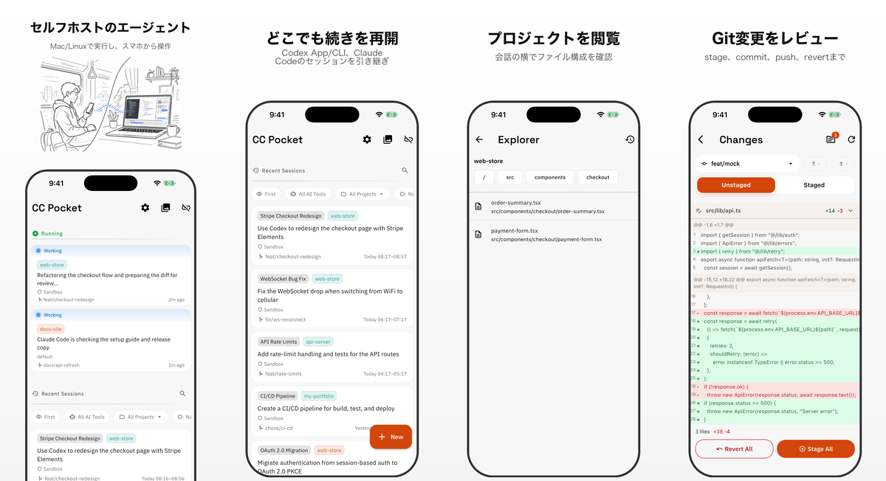

# CC Pocket

CC Pocket は、Codex / Claude のコーディングエージェントセッションを扱うモバイルクライアントです。エージェントは自分のマシンで実行しながら、スマホで開始・再開し、iPad や macOS ネイティブアプリにも広げられます。

[English README](README.md) | [简体中文版 README](README.zh-CN.md)

## クイックスタート

CC Pocket は3ステップで試せます。

1. Mac または Linux マシンで Bridge Server を実行します。

```bash
npx @ccpocket/bridge@latest
```

2. iOS、Android、macOS のいずれかに CC Pocket をインストールし、ターミナルに表示された QR コードをスキャンします。
3. プロジェクトを選び、Codex / Claude を選択して、アプリからセッションを開始します。

| プラットフォーム | インストール |
|------------------|--------------|
| **iOS / iPadOS** | <a href="https://apps.apple.com/jp/app/cc-pocket-%E3%81%A9%E3%81%93%E3%81%A7%E3%82%82%E3%82%B3%E3%83%BC%E3%83%87%E3%82%A3%E3%83%B3%E3%82%B0/id6759188790"></a> |
| **Android** | <a href="https://play.google.com/store/apps/details?id=com.k9i.ccpocket"></a> |
| **macOS** | 最新の `.dmg` は [GitHub Releases](https://github.com/K9i-0/ccpocket/releases?q=macos) からダウンロードできます。`macos/v*` タグのリリースを探してください。 |

Bridge Server は Codex / Claude が入っているマシンで動かします。ローカルネットワークの外から使う場合は、Tailscale を使ってマシンの Tailscale アドレスに接続してください。

<p align="center">
  
</p>

## 接続

1. ホストマシンに [Node.js](https://nodejs.org/) 18 以上と、少なくとも1つの CLI provider をインストールします: [Codex](https://github.com/openai/codex) または [Claude Code](https://docs.anthropic.com/en/docs/claude-code)。
2. Bridge Server を起動します。

```bash
npx @ccpocket/bridge@latest
```

3. アプリから、ターミナルの QR コード、保存済みマシン、mDNS 自動発見、または手入力の `ws://` / `wss://` URL で接続します。
4. プロジェクトを選び、Codex / Claude、モデル、モードを設定します。必要なら Worktree や Codex の追加書き込みディレクトリも有効にできます。

## できること

- **スマホ、iPad、macOS ネイティブアプリからセッションを開始・再開・監視**
- **iPad / macOS のマルチペイン対応アダプティブワークスペース** を利用
- **コマンド、ファイル編集、MCP リクエスト、エージェントの質問を素早く承認**
- **Codex の実行中に追加メッセージをキュー** し、送信前に編集・キャンセル
- **Codex の画像生成結果を表示** し、生成画像をセッション内に保持
- **File Peek と git diff ツールでコードレビュー**。シンタックスハイライト、変更ファイル移動、画像 diff、stage/revert、コミットメッセージ生成に対応
- **Markdown、補完、音声入力、画像添付でプロンプト作成**
- **使用量表示モードを切り替え** て、自分のワークフローに合う形式で利用上限を確認
- **Codex セッションを細かく調整**。profile、approval policy、Auto Review、plan mode、sandbox、追加書き込みディレクトリに対応
- **git worktree と `.gtrconfig` の copy/hooks で安全に並列作業**
- **承認待ちや完了をプッシュ通知** で受け取る
- **保存済みホスト、SSH start/stop/update、QR、mDNS でマシン管理**
- **macOS ネイティブアプリとアプリ内アップデート** で Mac でも同じ体験を使う

## なぜ CC Pocket？

AI コーディングエージェントは、機能まるごと自律的に書けるレベルに進化しています。開発者の役割は、コードを書くことから「判断」へ変わっています: ツールの承認、質問への回答、差分のレビュー。

判断にキーボードは要りません。画面と親指があれば十分です。

CC Pocket はこのワークフローのために作りました。スマホからセッションを開始し、自分のマシンの Codex / Claude に作業を任せ、どこにいても判断だけ行う。

## こんな人向け

CC Pocket は、すでにコーディングエージェントを実用的に使っていて、席を離れている間もセッションを追いたい人向けのアプリです。

- **長時間のエージェント実行を回す個人開発者**。Mac mini、Raspberry Pi、Linux サーバー、ノートPCなど
- **移動中や外出中でも開発を止めたくないインディーハッカーや創業者**
- **複数セッションと承認依頼を捌きたい AI ネイティブな開発者**
- **コードをホスト型 IDE ではなく自分のマシンに置いておきたいセルフホスター**

「エージェントを走らせて、必要なときだけ介入したい」という使い方に向いています。

## CC Pocket と Remote Control の違い

Claude Code の Remote Control は、Mac で始めたターミナルセッションをスマホに引き継ぐ機能です。

CC Pocket はアプローチが異なります。**セッションはスマホから始まり、CC Pocket 上で完結します。** ホストマシンはバックグラウンドで動き、スマホ、iPad、macOS アプリが操作インターフェースになります。

| | Remote Control | CC Pocket |
|---|---------------|-----------|
| セッション起点 | Mac で開始 → スマホに引き継ぎ | CC Pocket から開始 |
| 主たるデバイス | Mac（スマホは途中参加） | スマホ、iPad、macOS アプリ（ホストはバックグラウンド） |
| ユースケース | デスクの作業を移動中に続ける | どこからでもコーディングを始める |
| セットアップ | Claude Code に内蔵 | セルフホスト Bridge Server |

**具体的にできること・できないこと:**

- CC Pocket から新規セッションを開始し、最後まで完結 → **できる**
- ホストマシンに保存された過去のセッション履歴から再開 → **できる**
- Mac で直接開始したライブセッションに途中参加 → **できない**

## セッションモード

Bridge 側では、**Claude セッションは Claude Agent SDK で動作**します。セッション履歴は Claude Code と互換なので、CC Pocket から過去の Claude Code セッションを開いたり、必要に応じて Claude Code 側で続きを再開したりできます。

**Claude** は単一の **Permission Mode** で承認範囲とプランニングを制御します:

| Permission Mode | 挙動 |
|----------------|------|
| `Default` | 標準の対話モード |
| `Accept Edits` | ファイル編集は自動承認し、それ以外は確認 |
| `Plan` | まずプランを立て、承認後に実行する |
| `Auto` | 利用可能な環境では Claude の auto mode に承認挙動を任せる |
| `Bypass All` | すべて自動承認 |

**Codex** は関心ごとを独立した設定に分離しています:

| 設定 | 選択肢 | 説明 |
|------|--------|------|
| **Approval Policy** | `Untrusted` / `On Request` / `Auto Review` / `Never Ask` | Codex がどのタイミングで承認を求めるかを制御します。Auto Review もここで選択します。 |
| **Plan** | On / Off | Approval Policy とは独立してプランモードを切り替えます。 |
| **Sandbox** | On（デフォルト）/ Off | 安全のため制限された環境で実行します。 |
| **Profile** | Codex config profiles | 選択した Codex CLI profile で開始・再開します。 |
| **Additional Writable Directories** | 任意のパス | 選択したプロジェクトに加えて、別プロジェクトやディレクトリを書き込み可能にします。 |

> Codex はデフォルトで Sandbox On（安全側）。Claude はデフォルトで Sandbox Off です。

必要なら **Worktree** を有効にして、セッションごとに独立した git worktree を使えます。

### サポートしているモデルについて

CC Pocket は、Codex CLI や Claude で利用できるすべてのモデルをそのまま表示するわけではありません。
代わりに、Bridge Server 側で定義した「最近よく使われる主要モデル」のリストを提供し、必要に応じてモバイルアプリも同じ curated list をフォールバックとして使います。

これはモバイルでの設定やモデル選択をシンプルに保ちつつ、多くのユーザーが必要とするモデルを十分にカバーするための方針です。
追加のモデル対応は、利用可能モデルの一覧を Bridge 側で管理しているため、比較的簡単に行えます。

Codex CLI や Claude では使えるのに CC Pocket に表示されないモデルが必要な場合は、使いたい正確なモデル名を添えて Issue を作成してください。

## リモートアクセスとマシン管理

### Tailscale

外出先から Bridge Server に繋ぐなら、Tailscale が最も手軽です。

1. ホストマシンとスマホの両方に [Tailscale](https://tailscale.com/) を入れる
2. 同じ tailnet に参加する
3. アプリから `ws://<host-tailscale-ip>:8765` に接続する

### 保存済みマシンと SSH

アプリには、host / port / API key / 任意の SSH 認証情報を持つマシンを登録できます。

SSH を有効にすると、マシンカードから以下の操作ができます。

- `Start`
- `Stop Server`
- `Update Bridge`

この運用は **macOS (launchd)** および **Linux (systemd)** ホストに対応しています。

### サービスセットアップ

`setup` コマンドは OS を自動判定し、Bridge Server をバックグラウンドサービスとして登録します。

```bash
npx @ccpocket/bridge@latest setup
npx @ccpocket/bridge@latest setup --port 9000 --api-key YOUR_KEY
npx @ccpocket/bridge@latest setup --uninstall
```

グローバルインストール時:

```bash
ccpocket-bridge setup
```

#### macOS (launchd)

macOS では launchd plist を生成し `launchctl` で登録します。`zsh -li -c` 経由で起動するため、nvm・pyenv・Homebrew 等のシェル環境がそのまま引き継がれます。

#### Linux (systemd)

Linux では systemd ユーザーサービスを生成します。セットアップ時に `npx` のフルパスを解決するため、nvm/mise/volta 経由の Node.js でも正しく動作します。

> **Tip:** `loginctl enable-linger $USER` を実行すると、ログアウト後もサービスが継続します。

## Worktree 設定 (`.gtrconfig`)

セッション開始時に **Worktree** を有効にすると、[git worktree](https://git-scm.com/docs/git-worktree) で独立したブランチ・ディレクトリが自動的に作成されます。同じプロジェクトで複数のセッションを競合なく並行して実行できます。

プロジェクトルートに [`.gtrconfig`](https://github.com/coderabbitai/git-worktree-runner?tab=readme-ov-file#team-configuration-gtrconfig) を配置して、ファイルコピーとライフサイクルフックを設定します:

| セクション | キー | 説明 |
|-----------|------|------|
| `[copy]` | `include` | コピーするファイルの glob パターン（`.env` や設定ファイル等） |
| `[copy]` | `exclude` | コピーから除外する glob パターン |
| `[copy]` | `includeDirs` | 再帰的にコピーするディレクトリ名 |
| `[copy]` | `excludeDirs` | 除外するディレクトリ名 |
| `[hook]` | `postCreate` | worktree 作成後に実行するシェルコマンド |
| `[hook]` | `preRemove` | worktree 削除前に実行するシェルコマンド |

**Tips:** `.claude/settings.local.json` を `include` に含めるのが特におすすめです。MCP サーバー設定やパーミッション設定が各 worktree セッションに自動的に引き継がれます。

<details>
<summary><code>.gtrconfig</code> の設定例</summary>

```ini
[copy]
; Claude Code の設定: MCP サーバー、パーミッション、追加ディレクトリ
include = .claude/settings.local.json

; node_modules をコピーして worktree 構築を高速化
includeDirs = node_modules

[hook]
; worktree 作成後に Flutter の依存関係を復元
postCreate = cd apps/mobile && flutter pub get
```

</details>

## Sandbox 設定 (Claude Code)

アプリからサンドボックスモードを有効にすると、Claude Code はネイティブの `.claude/settings.json` または `.claude/settings.local.json` のサンドボックス設定を使用します。Bridge 側の設定は不要です。

`sandbox` スキーマの詳細は [Claude Code ドキュメント](https://docs.anthropic.com/en/docs/claude-code) を参照してください。

## Claude 認証について

> Warning
> `@ccpocket/bridge` バージョン `1.25.0` 未満は、Anthropic の現行 Claude Agent SDK ドキュメントではサードパーティ製品で Claude のサブスクリプションログインを許可していないため、新規インストールでの使用は非推奨です。
> `>=1.25.0` を使用し、OAuth の代わりに `ANTHROPIC_API_KEY` を設定してください。
>
> 2026年4月15日時点では、Anthropic の一部 Help ページに「Extra Usage / usage bundles が Claude アカウントを使う third-party products にも適用されうる」と読める記述があります。CC Pocket としては、Agent SDK でもそれが正式に許可されるなら OAuth ブロックを外したいと考えていますが、公開中の Claude Agent SDK ドキュメントでは依然としてサードパーティ製品による Claude のサブスクリプションログイン提供が禁止されています。ドキュメント同士の整合が取れるまでは、より厳しいガイダンスを優先して OAuth ブロックを維持します。
>
> **重要:** API キーは `ANTHROPIC_API_KEY` 環境変数で設定してください。Claude CLI 内の `/login` で設定したキーはサブスクリプションプランの認証と区別がつかず、現行のサードパーティ認証ガイダンスと衝突します。

## プラットフォーム補足

- **Bridge Server**: Node.js と CLI provider が動く環境なら利用可能
- **サービスセットアップ**: macOS (launchd) および Linux (systemd)
- **アプリからの SSH start/stop/update**: macOS (launchd) または Linux (systemd) ホスト
- **ウィンドウ一覧とスクリーンショット取得**: macOS ホスト専用
- **Tailscale**: 必須ではないが、リモート接続には強く推奨

常時稼働マシンとしては、Mac mini やヘッドレスの Linux ボックスが相性の良い構成です。

## スクリーンショット機能のためのホスト設定

macOS でスクリーンショット機能を使う場合は、Bridge Server を起動するターミナルアプリに **画面収録** 権限を付与してください。

権限がないと、`screencapture` が黒い画像を返すことがあります。

場所:

`システム設定 -> プライバシーとセキュリティ -> 画面収録`

常時稼働ホストで安定してウィンドウキャプチャを使うなら、ディスプレイのスリープと自動ロックも無効化しておくのがおすすめです。

```bash
sudo pmset -a displaysleep 0 sleep 0
```

## Supporter / Purchases

CC Pocket はセルフホストと最小限のデータ収集を前提に設計しています。購入のために専用の CC Pocket アカウントは必要ありません。

そのため、復元は同じストアアカウント内で動作します。

- Apple プラットフォーム: 同じ Apple ID
- Android: 同じ Google アカウント

Support 状態は iOS と Android 間では共有されません。

詳細は [docs/supporter_ja.md](docs/supporter_ja.md) を参照してください。

## 開発

### リポジトリ構成

```text
ccpocket/
├── packages/bridge/    # Bridge Server (TypeScript, WebSocket)
├── apps/mobile/        # Flutter mobile app
└── package.json        # npm workspaces root
```

### ソースからビルド

```bash
git clone https://github.com/K9i-0/ccpocket.git
cd ccpocket
npm install
cd apps/mobile && flutter pub get && cd ../..
```

### よく使うコマンド

| コマンド | 説明 |
|---------|------|
| `npm run bridge` | Bridge Server を開発モードで起動 |
| `npm run bridge:build` | Bridge Server をビルド |
| `npm run dev` | Bridge を再起動し、Flutter アプリも起動 |
| `npm run dev -- <device-id>` | デバイス指定付きで同上 |
| `npm run setup` | Bridge Server をバックグラウンドサービスとして登録 (launchd/systemd) |
| `npm run test:bridge` | Bridge Server のテスト実行 |
| `cd apps/mobile && flutter test` | Flutter テスト実行 |
| `cd apps/mobile && dart analyze` | Dart 静的解析 |

### 環境変数

| 変数 | デフォルト | 説明 |
|------|-----------|------|
| `BRIDGE_PORT` | `8765` | WebSocket ポート |
| `BRIDGE_HOST` | `0.0.0.0` | バインドアドレス |
| `BRIDGE_API_KEY` | 未設定 | API key 認証を有効化 |
| `BRIDGE_ALLOWED_DIRS` | `$HOME` | 許可するプロジェクトディレクトリ。カンマ区切り |
| `BRIDGE_PUBLIC_WS_URL` | 未設定 | 起動時の deep link / QR code に使う公開 `ws://` / `wss://` URL |
| `BRIDGE_DEMO_MODE` | 未設定 | デモ用に QR code / logs から Tailscale IP と API key を隠す |
| `BRIDGE_RECORDING` | 未設定 | デバッグ用のセッション録画を有効化 |
| `BRIDGE_DISABLE_MDNS` | 未設定 | mDNS 自動発見のアドバタイズメントを無効化 |
| `DIFF_IMAGE_AUTO_DISPLAY_KB` | `1024` | 画像 diff の自動表示しきい値 |
| `DIFF_IMAGE_MAX_SIZE_MB` | `5` | 画像 diff プレビューの最大サイズ |
| `HTTPS_PROXY` | 未設定 | 外向き fetch 用 proxy（`http://`, `socks5://`） |

## ライセンス

CC Pocket は Anthropic / OpenAI とは無関係であり、承認・提携・公式提供を受けたものではありません。

[FSL-1.1-MIT](LICENSE) — ソースコード公開。2028-03-17 に自動的に MIT へ移行します。

`@ccpocket/bridge` には Bridge Redistribution Exception を設けています。
Windows、WSL、proxy 必須環境、enterprise network など、メンテナが継続的に
検証しづらい環境向けの非公式再配布や環境特化 fork は許可されます。

ただし、それらの配布物は非公式かつ無保証であることを明確にしてください。
Anthropic、OpenAI、社内ネットワーク規約その他の第三者条件への適合責任は、
配布者および利用者にあります。
