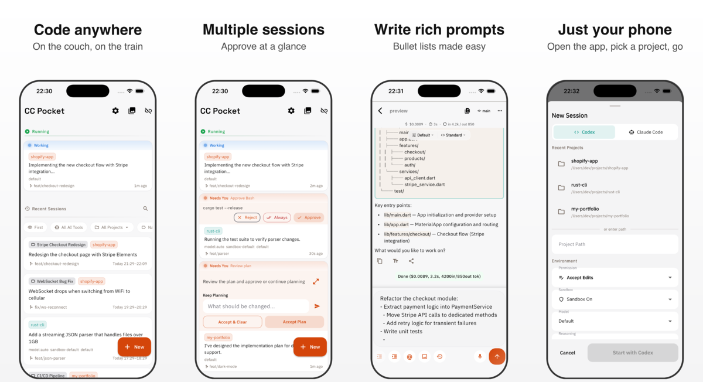

# ccpocket

Mobile client for Claude Code and Codex. Control coding agents from your iPhone or Android via a WebSocket bridge server.

[日本語版 README](README.ja.md)

<p align="center">
  
</p>

## Features

- **Chat** — Real-time conversation with Claude Code and Codex (streaming support)
- **Session Management** — Create, switch, browse history, and resume multiple sessions
- **Tool Approval** — Approve or reject file edits and command execution from your phone
- **Machine Management** — Register multiple machines, monitor status, remote start/stop via SSH
- **Diff Viewer** — View git diffs with syntax highlighting
- **Gallery** — Browse images and screenshots from sessions
- **Voice Input** — Dictate prompts with speech-to-text
- **Multiple Connection Methods** — Saved machines, QR code, mDNS auto-discovery, manual input

## Prerequisites

- [Node.js](https://nodejs.org/) v18+
- [Claude Code CLI](https://docs.anthropic.com/en/docs/claude-code) and/or [Codex CLI](https://github.com/openai/codex)

## Quick Start

### 1. Start the Bridge Server

```bash
# Run directly with npx (no install needed)
npx @ccpocket/bridge@latest

# Or install globally
npm install -g @ccpocket/bridge
ccpocket-bridge
```

A QR code will appear in your terminal. The server listens on `ws://0.0.0.0:8765` by default.

### 2. Install the Mobile App

<a href="https://play.google.com/store/apps/details?id=com.k9i.ccpocket">
  
</a>

iOS: Coming soon

### 3. Connect

| Method | Description |
|--------|-------------|
| **Saved Machines** (recommended) | One-tap connect to registered machines with auto-status and pinning |
| **QR Code** | Scan the QR code shown in terminal. URL and API key are auto-filled |
| **mDNS Auto-Discovery** | Automatically detects Bridge Servers on the same network (`_ccpocket._tcp`) |
| **Manual Input** | Enter URL directly (`ws://192.168.1.5:8765` or `192.168.1.5:8765`) |

Deep link: `ccpocket://connect?url=ws://IP:PORT&token=API_KEY`

### 4. Session Operations

**New Session**: Tap "+" to select a project and set the permission mode.

| Permission Mode | Description |
|----------------|-------------|
| Accept Edits | Auto-approve file edits, confirm others (default) |
| Plan Only | All actions require approval |
| Bypass All / Don't Ask | Auto-approve everything |
| Delegate | Allow delegation to sub-agents |

Optionally enable **Worktree** to isolate development in a separate git worktree branch.

**Resume**: Tap a past session from "Recent Sessions" on the home screen. Filter by project or search.

**Tool Approval**: Approval requests appear based on the permission mode. Review the tool name and input, then choose Approve or Reject.

## Machine Management & SSH Remote Control

Register machines from "Add Machine" on the connection screen.

| Field | Description |
|-------|-------------|
| Name | Display name (defaults to host:port) |
| Host | IP address or hostname |
| Port | Bridge Server port (default: 8765) |
| API Key | Bridge Server API key (optional) |
| SSH | Enable SSH remote control (set username, port, auth method) |

With SSH enabled, the following actions are available from the machine card menu:

| Action | Description |
|--------|-------------|
| **Start** | Start Bridge Server via `launchctl start` |
| **Stop Server** | Stop Bridge Server via `launchctl stop` |
| **Update Bridge** | Run `git pull` → build → restart service |

> **Prerequisite**: The remote machine must be macOS (launchd) with the service registered via `npm run setup`.

## Remote Access (Tailscale)

Install [Tailscale](https://tailscale.com/) on both your Mac and iPhone, join the same network, and connect from anywhere. Enter `ws://<Mac Tailscale IP>:8765` as the Server URL in the app.

### launchd Persistence

Run the Bridge Server as a launchd service for SSH-based Start/Stop:

```bash
npm run setup                                    # Auto setup
npm run setup -- --port 9000 --api-key YOUR_KEY  # Custom port & API key
npm run setup -- --uninstall                     # Uninstall
```

## macOS Host Configuration (Always-on Mac)

When running Bridge Server on an always-on Mac (e.g., Mac mini), additional configuration is needed for the screenshot feature.

### Screen Recording Permission (Required)

Grant **Screen Recording** permission to the terminal app running Bridge Server. Without it, `screencapture` silently returns a black image.

> System Settings → Privacy & Security → Screen Recording → Add your terminal app

Restart the terminal app after changing permissions.

### Keep Display On & Disable Auto-Lock (Recommended)

When the display sleeps or locks, window IDs become invalid and capture fails. macOS prevents access to window buffers while locked.

```bash
# Disable display and system sleep
sudo pmset -a displaysleep 0 sleep 0
```

| Setting | Location | Value |
|---------|----------|-------|
| Auto-Lock | System Settings → Lock Screen | **Never** |
| Screen Saver | System Settings → Screen Saver | **Never** |

Manual lock (Ctrl+Cmd+Q) still works. Enable FileVault if physical security is needed.

---

## Development

### Architecture

```
┌─────────────┐     WebSocket      ┌────────────────┐     stdio      ┌──────────────┐
│  Flutter App │ ◄──────────────► │  Bridge Server  │ ◄────────────► │  Claude CLI   │
│  (iOS/Android)│                   │  (TypeScript)   │                │              │
└─────────────┘                    └────────────────┘                └──────────────┘
```

| Layer | Technology |
|-------|-----------|
| Mobile App | Flutter / Dart |
| Bridge Server | TypeScript / Node.js / ws |
| Package Management | npm workspaces |

### Build from Source

```bash
git clone https://github.com/K9i-0/ccpocket.git
cd ccpocket
npm install
cd apps/mobile && flutter pub get && cd ../..
```

### Development Commands

| Command | Description |
|---------|-------------|
| `npm run bridge` | Start Bridge Server (dev mode) |
| `npm run bridge:build` | Build Bridge Server |
| `npm run dev` | Start Bridge + Flutter together |
| `npm run dev -- <device>` | Start with device specified |
| `npm run setup` | Register launchd service |
| `npm run test:bridge` | Run Bridge Server tests |
| `cd apps/mobile && flutter test` | Run Flutter tests |
| `cd apps/mobile && dart analyze` | Dart static analysis |

### Environment Variables

| Variable | Default | Description |
|----------|---------|-------------|
| `BRIDGE_PORT` | `8765` | WebSocket port |
| `BRIDGE_HOST` | `0.0.0.0` | Bind address |
| `BRIDGE_API_KEY` | (none) | API key authentication (enabled when set) |

## License

[MIT](LICENSE)
