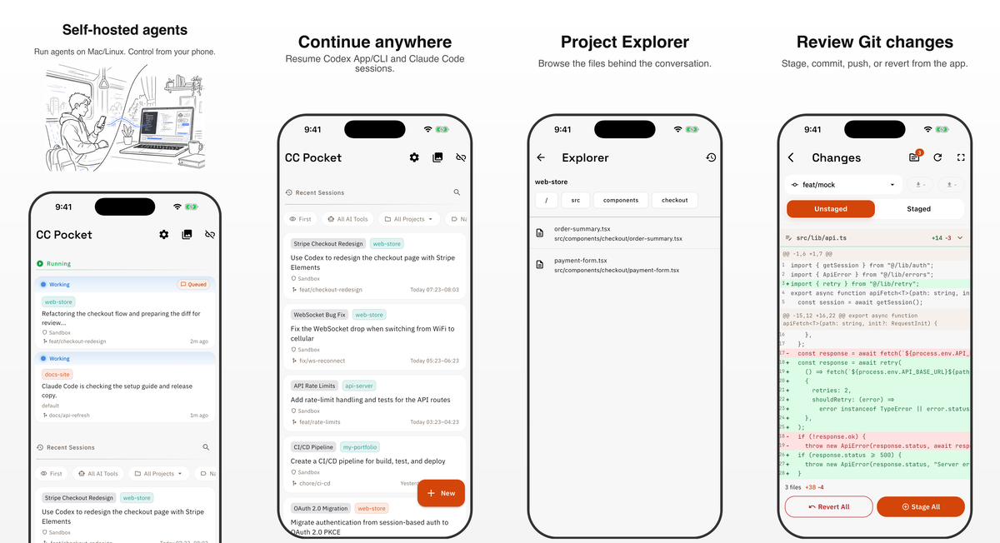

# CC Pocket

CC Pocket is a mobile client for Codex and Claude coding-agent sessions. Start or resume sessions from your phone, expand to iPad, or use the native macOS app while your own machine runs the agents.

[日本語版 README](README.ja.md) | [简体中文版 README](README.zh-CN.md)

## Install

Set up CC Pocket in three steps:

1. Install the app on iOS, Android, or macOS.
2. Run the Bridge Server on the machine that has Codex or Claude installed.
3. Scan the terminal QR code from the app and start a session.

| Platform | Install |
|----------|---------|
| **iOS / iPadOS** | <a href="https://apps.apple.com/us/app/cc-pocket-code-anywhere/id6759188790"></a> |
| **Android** | <a href="https://play.google.com/store/apps/details?id=com.k9i.ccpocket"></a> |
| **macOS** | Download the latest `.dmg` from [GitHub Releases](https://github.com/K9i-0/ccpocket/releases?q=macos). Look for releases tagged `macos/v*`. |
| **Bridge Server** | Run `npx @ccpocket/bridge@latest` on the machine that will run Codex or Claude. |

The Bridge Server prints a QR code in your terminal. Scan it from the app to connect.

<p align="center">
  
</p>

## Connect

1. Install [Node.js](https://nodejs.org/) 18+ and at least one CLI provider on your host machine: [Codex](https://github.com/openai/codex) or [Claude Code](https://docs.anthropic.com/en/docs/claude-code).
2. Start the Bridge Server:

```bash
npx @ccpocket/bridge@latest
```

3. Connect from the app with the terminal QR code, a saved machine, mDNS auto-discovery, or a manual `ws://` / `wss://` URL.
4. Pick a project, choose Codex or Claude, select the model and modes, and optionally enable Worktree or extra Codex writable directories.

## What You Can Do

- **Start, resume, and monitor sessions** from phone, iPad, or the native macOS app
- **Use an adaptive workspace** with multi-pane layouts on iPad and macOS
- **Handle approvals quickly** for commands, file edits, MCP requests, and agent questions
- **Queue Codex follow-up messages** while a turn is running, then edit or cancel queued input
- **Use Codex image generation results** with generated images kept visible in the session
- **Review code with File Peek and git diff tools** including syntax highlighting, changed-file navigation, image diffs, staging, reverting, and commit-message generation
- **Write richer prompts** with Markdown, completions, voice input, and image attachments
- **Switch usage display modes** to see usage limits in the format that fits your workflow
- **Tune Codex sessions** with profiles, approval policy, Auto Review, plan mode, sandbox mode, and additional writable directories
- **Run parallel work safely** with git worktrees and `.gtrconfig` copy/hooks
- **Stay notified** with push notifications for approval requests and session results
- **Manage machines remotely** with saved hosts, SSH start/stop/update, QR codes, and mDNS discovery
- **Keep macOS current** with the native desktop app and in-app updates

## Why CC Pocket?

AI coding agents are getting autonomous enough to write entire features on their own. Your role shifts from writing code to making decisions: approve this tool, answer that question, review the diff.

Decisions do not need a keyboard. They need a screen and a thumb.

CC Pocket is built for this workflow: start a session from your phone, let your machine's Codex or Claude do the heavy lifting, and make decisions from wherever you are.

## Who It's For

CC Pocket is for people who already rely on coding agents and want an easier way to stay in the loop when they are away from the keyboard.

- **Solo developers running long agent sessions** on a Mac mini, Raspberry Pi, Linux server, or laptop
- **Indie hackers and founders** who want to keep shipping while commuting, walking, or away from their desk
- **AI-native engineers** juggling multiple sessions and frequent approval requests
- **Self-hosters** who want their code to stay on their own machine instead of a hosted IDE

If your workflow is "start an agent, let it run, step in only when needed," CC Pocket is built for that.

## CC Pocket vs Remote Control

Claude Code's built-in Remote Control hands off an existing terminal session to your phone: you start on your Mac and continue from mobile.

CC Pocket takes a different approach: **sessions start on your phone and run to completion there.** Your Mac works in the background; your phone is the primary interface.

| | Remote Control | CC Pocket |
|---|---------------|-----------|
| Session origin | Start on Mac, hand off to phone | Start on phone |
| Primary device | Mac (phone joins later) | Phone, iPad, or macOS app (host runs in background) |
| Use case | Continue a desktop task on the go | Start coding from anywhere |
| Setup | Built into Claude Code | Self-hosted Bridge Server |

**What this means in practice:**

- You **can** start a brand-new session and run it entirely from CC Pocket
- You **can** reopen past sessions from history stored on your host machine
- You **cannot** attach to a live session that was started directly on your Mac

## Session Modes

On the Bridge side, **Claude sessions are powered by the Claude Agent SDK**. Session history remains compatible with Claude Code, so you can reopen past Claude Code sessions from CC Pocket and continue them in Claude Code when needed.

**Claude** uses a single **Permission Mode** that controls both approval scope and planning:

| Permission Mode | Behavior |
|----------------|----------|
| `Default` | Standard interactive mode |
| `Accept Edits` | Auto-approve file edits, ask for everything else |
| `Plan` | Draft a plan first, then wait for your approval before executing |
| `Auto` | Let Claude's auto mode handle approval behavior when available |
| `Bypass All` | Auto-approve everything |

**Codex** separates concerns into independent controls:

| Setting | Options | Description |
|---------|---------|-------------|
| **Approval Policy** | `Untrusted` / `On Request` / `On Failure` / `Never Ask` | Controls when Codex asks for approval. `On Failure` is kept for compatibility and is deprecated. |
| **Approval Reviewer** | Default / `Auto Review` | Lets Codex use Auto Review as the approval reviewer when supported by the Bridge. |
| **Plan** | On / Off | Toggle planning mode independently of approval policy. |
| **Sandbox** | On (default) / Off | Run in a restricted environment for safety. |
| **Profile** | Codex config profiles | Start or resume with a selected Codex CLI profile. |
| **Additional Writable Directories** | Optional paths | Make another project or directory writable alongside the selected project. |

> Codex defaults to Sandbox On for safety. Claude defaults to Sandbox Off.

You can also enable **Worktree** to isolate a session in its own git worktree.

### Supported Models

CC Pocket does not expose every model available in the Codex CLI or Claude.
Instead, the Bridge Server provides a curated list of recent, commonly used models, and the mobile app falls back to that same curated set when needed.

This keeps the setup and model picker simpler on mobile while still covering the models most users are likely to want.
Adding support for more models is usually straightforward because the available model list is defined on the Bridge side.

If a model is available in Codex CLI or Claude but not shown in CC Pocket, please open an issue with the exact model name you want to use.

## Remote Access and Machine Management

### Tailscale

Tailscale is the easiest way to reach your Bridge Server outside your home or office network.

1. Install [Tailscale](https://tailscale.com/) on your host machine and phone.
2. Join the same tailnet.
3. Connect to `ws://<host-tailscale-ip>:8765` from the app.

### Saved Machines and SSH

You can register machines in the app with host, port, API key, and optional SSH credentials.

When SSH is enabled, CC Pocket can trigger these remote actions from the machine card:

- `Start`
- `Stop Server`
- `Update Bridge`

This flow supports **macOS (launchd)** and **Linux (systemd)** hosts.

### Service Setup

The `setup` command automatically detects your OS and registers the Bridge Server as a managed background service.

```bash
npx @ccpocket/bridge@latest setup
npx @ccpocket/bridge@latest setup --port 9000 --api-key YOUR_KEY
npx @ccpocket/bridge@latest setup --uninstall
```

Global install variant:

```bash
ccpocket-bridge setup
```

#### macOS (launchd)

On macOS, `setup` creates a launchd plist and registers it with `launchctl`. The service starts via `zsh -li -c` to inherit your shell environment (nvm, pyenv, Homebrew, etc.).

#### Linux (systemd)

On Linux, `setup` creates a systemd user service. It resolves the full path to `npx` at setup time so that nvm/mise/volta-managed Node.js works correctly under systemd.

> **Tip:** Run `loginctl enable-linger $USER` to keep the service running after logout.

## Worktree Configuration (`.gtrconfig`)

When starting a session, you can enable **Worktree** to automatically create a [git worktree](https://git-scm.com/docs/git-worktree) with its own branch and directory. This lets you run multiple sessions in parallel on the same project without conflicts.

Place a [`.gtrconfig`](https://github.com/coderabbitai/git-worktree-runner?tab=readme-ov-file#team-configuration-gtrconfig) file in your project root to configure file copying and lifecycle hooks:

| Section | Key | Description |
|---------|-----|-------------|
| `[copy]` | `include` | Glob patterns for files to copy (for example `.env` or config files) |
| `[copy]` | `exclude` | Glob patterns to exclude from copy |
| `[copy]` | `includeDirs` | Directory names to copy recursively |
| `[copy]` | `excludeDirs` | Directory names to exclude |
| `[hook]` | `postCreate` | Shell command(s) to run after worktree creation |
| `[hook]` | `preRemove` | Shell command(s) to run before worktree deletion |

**Tip:** Adding `.claude/settings.local.json` to the `include` list is especially recommended. This carries over your MCP server configuration and permission settings to each worktree session automatically.

<details>
<summary>Example <code>.gtrconfig</code></summary>

```ini
[copy]
; Claude Code settings: MCP servers, permissions, additional directories
include = .claude/settings.local.json

; Speed up worktree setup by copying node_modules
includeDirs = node_modules

[hook]
; Restore Flutter dependencies after worktree creation
postCreate = cd apps/mobile && flutter pub get
```

</details>

## Sandbox Configuration (Claude Code)

When sandbox mode is enabled from the app, Claude Code uses its native `.claude/settings.json` or `.claude/settings.local.json` for detailed sandbox configuration. No Bridge-side config is needed.

See the [Claude Code documentation](https://docs.anthropic.com/en/docs/claude-code) for the full `sandbox` schema.

## Claude Authentication Note

> Warning
> `@ccpocket/bridge` versions older than `1.25.0` are deprecated for new installs because current Anthropic Claude Agent SDK docs do not permit third-party products to use Claude subscription login.
> Use `>=1.25.0` and configure `ANTHROPIC_API_KEY` instead of OAuth.
>
> As of April 15, 2026, some Anthropic help pages suggest Extra Usage / usage bundles may apply to third-party products using a Claude account. CC Pocket would like to remove this OAuth block if that policy is officially supported for the Agent SDK, but the published Claude Agent SDK docs still prohibit third-party products from offering Claude subscription login. Until those docs are aligned, CC Pocket keeps the OAuth block in place and follows the stricter guidance.
>
> **Important:** Set your API key via the `ANTHROPIC_API_KEY` environment variable, not through `/login` in the Claude CLI. Keys configured via `/login` are indistinguishable from subscription-plan credentials, which would conflict with the current third-party auth guidance.

## Platform Notes

- **Bridge Server**: works anywhere Node.js and your CLI provider work
- **Service setup**: macOS (launchd) and Linux (systemd)
- **SSH start/stop/update from the app**: macOS (launchd) or Linux (systemd) host
- **Window listing and screenshot capture**: macOS-only host feature
- **Tailscale**: optional, but strongly recommended for remote access

If you want a clean always-on setup, a Mac mini or a headless Linux box is the best-supported host environment right now.

## Host Configuration for Screenshot Capture

If you want to use screenshot capture on macOS, grant **Screen Recording** permission to the terminal app that runs the Bridge Server.

Without it, `screencapture` can return black images.

Path:

`System Settings -> Privacy & Security -> Screen Recording`

For reliable window capture on an always-on host, it also helps to disable display sleep and auto-lock.

```bash
sudo pmset -a displaysleep 0 sleep 0
```

## Supporter / Purchases

CC Pocket is designed around self-hosting and minimal data collection. It does not require a dedicated CC Pocket account for purchases.

Because of that, restore works within the same store account:

- Apple platforms: the same Apple ID
- Android: the same Google account

Support status is not shared between iOS and Android.

See [docs/supporter.md](docs/supporter.md) for the full explanation.

## Development

### Repository Layout

```text
ccpocket/
├── packages/bridge/    # Bridge Server (TypeScript, WebSocket)
├── apps/mobile/        # Flutter mobile app
└── package.json        # npm workspaces root
```

### Build From Source

```bash
git clone https://github.com/K9i-0/ccpocket.git
cd ccpocket
npm install
cd apps/mobile && flutter pub get && cd ../..
```

### Common Commands

| Command | Description |
|---------|-------------|
| `npm run bridge` | Start Bridge Server in dev mode |
| `npm run bridge:build` | Build the Bridge Server |
| `npm run dev` | Restart Bridge and launch the Flutter app |
| `npm run dev -- <device-id>` | Same as above, with a specific device |
| `npm run setup` | Register the Bridge Server as a background service (launchd/systemd) |
| `npm run test:bridge` | Run Bridge Server tests |
| `cd apps/mobile && flutter test` | Run Flutter tests |
| `cd apps/mobile && dart analyze` | Run Dart static analysis |

### Environment Variables

| Variable | Default | Description |
|----------|---------|-------------|
| `BRIDGE_PORT` | `8765` | WebSocket port |
| `BRIDGE_HOST` | `0.0.0.0` | Bind address |
| `BRIDGE_API_KEY` | unset | Enables API key authentication |
| `BRIDGE_ALLOWED_DIRS` | `$HOME` | Allowed project directories, comma-separated |
| `BRIDGE_PUBLIC_WS_URL` | unset | Public `ws://` / `wss://` URL used for startup deep link and QR code |
| `BRIDGE_DEMO_MODE` | unset | Hides Tailscale IPs and API key from QR code / logs for demos |
| `BRIDGE_RECORDING` | unset | Enables session recording for debugging |
| `BRIDGE_DISABLE_MDNS` | unset | Disables mDNS auto-discovery advertisement |
| `DIFF_IMAGE_AUTO_DISPLAY_KB` | `1024` | Auto-display threshold for image diffs |
| `DIFF_IMAGE_MAX_SIZE_MB` | `5` | Max image size for diff previews |
| `HTTPS_PROXY` | unset | Proxy for outgoing fetch requests (`http://`, `socks5://`) |

## License

CC Pocket is not affiliated with, endorsed by, or associated with Anthropic or OpenAI.

[FSL-1.1-MIT](LICENSE) — Source available. Converts to MIT on 2028-03-17.

The repository includes a Bridge Redistribution Exception for `@ccpocket/bridge`.
Unofficial Bridge redistributions and environment-specific forks are allowed,
for example to support Windows, WSL, proxies, or enterprise networks that are
hard for the maintainer to validate continuously.

Those redistributions must remain clearly unofficial and unsupported. Compliance
with Anthropic, OpenAI, enterprise, network, and other third-party terms remains
the responsibility of the redistributor and end user.
