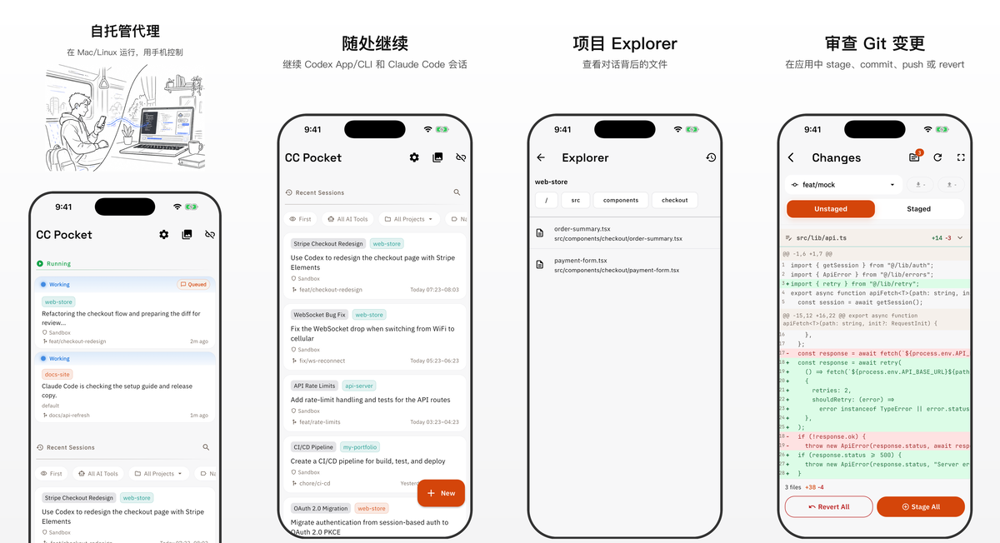

# CC Pocket

CC Pocket 是一款用于 Codex / Claude 编程代理会话的移动客户端。代理运行在你自己的机器上，你可以用手机启动或恢复会话，也可以扩展到 iPad 和原生 macOS App。

[English README](README.md) | [日本語 README](README.ja.md)

## 安装

CC Pocket 只需要三步即可开始使用：

1. 在 iOS、Android 或 macOS 上安装 App
2. 在已安装 Codex / Claude 的主机上启动 Bridge Server
3. 用 App 扫描终端二维码并开始会话

| 平台 | 安装 |
|------|------|
| **iOS / iPadOS** | <a href="https://apps.apple.com/us/app/cc-pocket-code-anywhere/id6759188790"></a> |
| **Android** | <a href="https://play.google.com/store/apps/details?id=com.k9i.ccpocket"></a> |
| **macOS** | 从 [GitHub Releases](https://github.com/K9i-0/ccpocket/releases?q=macos) 下载最新 `.dmg`。请查找带有 `macos/v*` 标签的发行版。 |
| **Bridge Server** | 在运行 Codex 或 Claude 的主机上执行 `npx @ccpocket/bridge@latest`。 |

Bridge Server 启动后会在终端打印二维码。用 App 扫描即可连接。

<p align="center">
  
</p>

## 连接

1. 在主机上安装 [Node.js](https://nodejs.org/) 18+，以及至少一个 CLI 提供方：[Codex](https://github.com/openai/codex) 或 [Claude Code](https://docs.anthropic.com/en/docs/claude-code)。
2. 启动 Bridge Server：

```bash
npx @ccpocket/bridge@latest
```

3. 在 App 中通过终端二维码、已保存机器、mDNS 自动发现，或手动输入 `ws://` / `wss://` URL 连接。
4. 选择项目、Codex 或 Claude、模型和模式。需要时也可以启用 Worktree 或 Codex 额外可写目录。

## 可以做什么

- **从手机、iPad 或原生 macOS App 启动、恢复和监控会话**
- **使用 iPad / macOS 的自适应工作区**，支持多窗格布局
- **快速处理审批**，包括命令、文件编辑、MCP 请求和代理提问
- **在 Codex 正在执行时排队追加消息**，并在发送前编辑或取消
- **显示 Codex 图片生成结果**，让生成图片保留在会话中
- **用 File Peek 和 git diff 工具审查代码**，支持语法高亮、变更文件跳转、图片 diff、stage/revert 和提交信息生成
- **编写更丰富的提示词**，支持 Markdown、补全、语音输入和图片附件
- **切换使用量显示模式**，用适合自己工作流的方式查看使用限制
- **精细调节 Codex 会话**，支持 profile、approval policy、Auto Review、plan mode、sandbox 和额外可写目录
- **通过 git worktree 与 `.gtrconfig` copy/hooks 安全并行工作**
- **通过推送通知获知审批请求和会话结果**
- **通过已保存主机、SSH start/stop/update、二维码和 mDNS 管理机器**
- **使用原生 macOS App 与应用内更新**，在 Mac 上获得同一套体验

## 为什么做 CC Pocket？

AI 编程代理已经越来越接近能够自主完成整个功能开发。开发者的角色，也从“亲手写代码”逐渐转向“做判断”：批准工具调用、回答问题、审查 diff。

做判断不需要键盘，只需要一块屏幕和一根手指。

CC Pocket 就是围绕这种工作方式设计的：你在手机上发起会话，让自己机器上的 Codex / Claude 在后台执行，而你无论身在何处，都可以只做关键决策。

## 适合谁用

CC Pocket 面向已经在日常工作中依赖编程代理、并希望离开电脑时也能持续跟进会话的人。

- **运行长时间代理会话的独立开发者**，例如使用 Mac mini、Raspberry Pi、Linux 服务器或笔记本
- **希望在通勤、散步、外出时也能继续交付的独立开发者和创业者**
- **同时管理多个会话、频繁处理审批请求的 AI Native 工程师**
- **希望代码始终留在自己机器上，而不是托管在云 IDE 中的自托管用户**

如果你的工作方式是“启动一个代理，让它跑起来，只在必要时介入”，那 CC Pocket 就是为你准备的。

## CC Pocket 和 Remote Control 的区别

Claude Code 自带的 Remote Control 会把一个已经在 Mac 上启动的终端会话交接到手机上，也就是你先在桌面端开始，再从移动端继续。

CC Pocket 走的是另一条路：**会话从 CC Pocket 发起，并在 CC Pocket 中完成整个流程。** 主机在后台执行，而手机、iPad 或 macOS App 是操作界面。

| | Remote Control | CC Pocket |
|---|---------------|-----------|
| 会话起点 | 先在 Mac 上开始，再交接给手机 | 从 CC Pocket 开始 |
| 主要设备 | Mac（手机后续加入） | 手机、iPad 或 macOS App（主机在后台执行） |
| 典型场景 | 把桌面任务带到路上继续 | 随时随地直接开始编码 |
| 配置方式 | Claude Code 内置 | 自托管 Bridge Server |

**实际意味着：**

- 你**可以**从 CC Pocket 直接启动一个全新的会话，并完整跑完
- 你**可以**重新打开保存在主机上的历史会话
- 你**不能**接入一个已经直接在 Mac 上启动的实时会话

## 会话模式

在 Bridge 端，**Claude 会话由 Claude Agent SDK 驱动**。会话历史仍与 Claude Code 兼容，因此你可以在 CC Pocket 中重新打开过去的 Claude Code 会话，也可以在需要时回到 Claude Code 继续处理。

**Claude** 使用单一的 **Permission Mode** 来控制审批范围和规划：

| Permission Mode | 行为 |
|----------------|------|
| `Default` | 标准交互模式 |
| `Accept Edits` | 自动批准文件编辑，其他操作仍需确认 |
| `Plan` | 先制定计划，等你批准后再执行 |
| `Auto` | 在可用环境中，让 Claude 的 auto mode 处理审批行为 |
| `Bypass All` | 自动批准所有操作 |

**Codex** 将关注点分离为独立的设置：

| 设置 | 选项 | 说明 |
|------|------|------|
| **Approval Policy** | `Untrusted` / `On Request` / `On Failure` / `Never Ask` | 控制 Codex 何时请求审批。`On Failure` 为兼容保留，已弃用。 |
| **Approval Reviewer** | Default / `Auto Review` | 当 Bridge 支持时，可以让 Codex 使用 Auto Review 作为 approval reviewer。 |
| **Plan** | 开 / 关 | 独立于 Approval Policy 切换规划模式。 |
| **Sandbox** | 开（默认）/ 关 | 在受限环境中运行，偏向安全。 |
| **Profile** | Codex config profiles | 使用选定的 Codex CLI profile 启动或恢复会话。 |
| **Additional Writable Directories** | 可选路径 | 让另一个项目或目录与当前项目一起可写。 |

> Codex 默认开启 Sandbox（偏向安全）。Claude 默认关闭 Sandbox。

你也可以启用 **Worktree**，把每个会话隔离到独立的 git worktree 中。

### 支持的模型说明

CC Pocket 不会直接展示 Codex CLI 或 Claude 中全部可用模型。
相反，Bridge Server 会提供一份精选的模型列表，优先包含近期常用的主流模型；在需要时，移动端也会用这份相同的 curated list 作为后备。

这样可以让移动端的配置和模型选择界面保持简洁，同时覆盖大多数用户真正会用到的模型。
由于可用模型列表定义在 Bridge 端，后续增加模型支持通常也比较直接。

如果某个模型在 Codex CLI 或 Claude 中可用，但没有出现在 CC Pocket 里，欢迎提交 issue，并附上你想使用的准确模型名。

## 远程访问与机器管理

### Tailscale

如果你要在家庭或办公室网络之外访问 Bridge Server，最简单的方式就是 Tailscale。

1. 在主机和手机上都安装 [Tailscale](https://tailscale.com/)
2. 加入同一个 tailnet
3. 在 App 中连接 `ws://<host-tailscale-ip>:8765`

### 已保存机器与 SSH

你可以在 App 中登记机器信息，包括 host、port、API key，以及可选的 SSH 凭据。

启用 SSH 后，CC Pocket 可以直接在机器卡片上触发这些远程操作：

- `Start`
- `Stop Server`
- `Update Bridge`

这个流程支持 **macOS（launchd）** 和 **Linux（systemd）** 主机。

### 服务化设置

`setup` 命令会自动识别你的操作系统，并把 Bridge Server 注册成一个受管理的后台服务。

```bash
npx @ccpocket/bridge@latest setup
npx @ccpocket/bridge@latest setup --port 9000 --api-key YOUR_KEY
npx @ccpocket/bridge@latest setup --uninstall
```

全局安装后的写法：

```bash
ccpocket-bridge setup
```

#### macOS（launchd）

在 macOS 上，`setup` 会创建 launchd plist，并使用 `launchctl` 注册服务。服务通过 `zsh -li -c` 启动，因此能够继承你的 shell 环境（nvm、pyenv、Homebrew 等）。

#### Linux（systemd）

在 Linux 上，`setup` 会创建 systemd user service。它会在 setup 阶段解析 `npx` 的完整路径，从而确保 nvm、mise、volta 管理的 Node.js 也能在 systemd 下正常工作。

> **提示：** 运行 `loginctl enable-linger $USER` 后，服务会在你退出登录后继续运行。

## Worktree 配置（`.gtrconfig`）

在启动会话时启用 **Worktree** 后，应用会自动创建一个带独立分支和目录的 [git worktree](https://git-scm.com/docs/git-worktree)。这样你就可以在同一个项目上并行运行多个会话，而不会互相冲突。

你可以在项目根目录放置一个 [`.gtrconfig`](https://github.com/coderabbitai/git-worktree-runner?tab=readme-ov-file#team-configuration-gtrconfig) 文件，配置文件复制规则和生命周期钩子：

| 区块 | 键 | 说明 |
|------|----|------|
| `[copy]` | `include` | 需要复制的文件 glob，例如 `.env` 或配置文件 |
| `[copy]` | `exclude` | 从复制中排除的 glob 模式 |
| `[copy]` | `includeDirs` | 需要递归复制的目录名 |
| `[copy]` | `excludeDirs` | 需要排除的目录名 |
| `[hook]` | `postCreate` | worktree 创建后执行的 shell 命令 |
| `[hook]` | `preRemove` | worktree 删除前执行的 shell 命令 |

**提示：** 特别推荐把 `.claude/settings.local.json` 加进 `include`。这样每个 worktree 会话都能自动继承你的 MCP 服务器配置和权限设置。

<details>
<summary><code>.gtrconfig</code> 示例</summary>

```ini
[copy]
; Claude Code 设置: MCP 服务器、权限、额外目录
include = .claude/settings.local.json

; 复制 node_modules，加快 worktree 初始化
includeDirs = node_modules

[hook]
; 创建 worktree 后恢复 Flutter 依赖
postCreate = cd apps/mobile && flutter pub get
```

</details>

## Sandbox 配置（Claude Code）

当你在 App 中启用 sandbox mode 时，Claude Code 会使用它原生的 `.claude/settings.json` 或 `.claude/settings.local.json` 来读取更细粒度的 sandbox 配置。Bridge 端不需要单独配置。

完整的 `sandbox` schema 请参考 [Claude Code 文档](https://docs.anthropic.com/en/docs/claude-code)。

## Claude 认证说明

> Warning
> `@ccpocket/bridge` `1.25.0` 之前的版本已不建议新安装使用，因为 Anthropic 当前的 Claude Agent SDK 文档不允许第三方产品使用 Claude 订阅登录。
> 请使用 `>=1.25.0` 版本，并配置 `ANTHROPIC_API_KEY` 替代 OAuth。
>
> 截至 2026 年 4 月 15 日，Anthropic 的部分帮助页面看起来表示 Extra Usage / usage bundles 可能适用于使用 Claude 账号的第三方产品。CC Pocket 也希望如果 Agent SDK 正式允许这类用法，就移除当前的 OAuth 屏蔽；但已发布的 Claude Agent SDK 文档仍然禁止第三方产品提供 Claude 订阅登录。在这些文档口径统一之前，CC Pocket 会继续保留 OAuth 屏蔽，并遵循更严格的那份指引。
>
> **重要提示：** 请通过 `ANTHROPIC_API_KEY` 环境变量设置 API 密钥，而不要通过 Claude CLI 中的 `/login` 设置。通过 `/login` 设置的密钥无法与订阅计划凭证区分，这会与当前的第三方认证指引冲突。

## 平台说明

- **Bridge Server**：只要 Node.js 和对应的 CLI 提供方能运行，就可以使用
- **服务化设置**：支持 macOS（launchd）和 Linux（systemd）
- **通过 App 使用 SSH 执行 start/stop/update**：要求主机是 macOS（launchd）或 Linux（systemd）
- **窗口列表和截图能力**：仅支持 macOS 主机
- **Tailscale**：不是必须，但强烈推荐用于远程访问

如果你想搭一个整洁、稳定、长期在线的环境，目前最适合的主机依然是 Mac mini 或无头 Linux 机器。

## 截图功能所需的主机配置

如果你要在 macOS 上使用截图功能，请为运行 Bridge Server 的终端应用授予 **屏幕录制** 权限。

否则，`screencapture` 可能会返回全黑的图片。

路径：

`系统设置 -> 隐私与安全性 -> 屏幕录制`

如果你的主机是长期在线的，为了让窗口截图更稳定，也建议关闭显示器休眠和自动锁屏。

```bash
sudo pmset -a displaysleep 0 sleep 0
```

## Supporter / Purchases

CC Pocket 围绕自托管和最少数据收集设计。购买不需要专门的 CC Pocket 账号。

因此，恢复购买只在同一个应用商店账号内生效：

- Apple 平台：同一个 Apple ID
- Android：同一个 Google 账号

Support 状态不会在 iOS 和 Android 之间共享。

完整说明见 [docs/supporter_zh.md](docs/supporter_zh.md)。

## 开发

### 仓库结构

```text
ccpocket/
├── packages/bridge/    # Bridge Server (TypeScript, WebSocket)
├── apps/mobile/        # Flutter mobile app
└── package.json        # npm workspaces root
```

### 从源码构建

```bash
git clone https://github.com/K9i-0/ccpocket.git
cd ccpocket
npm install
cd apps/mobile && flutter pub get && cd ../..
```

### 常用命令

| 命令 | 说明 |
|------|------|
| `npm run bridge` | 以开发模式启动 Bridge Server |
| `npm run bridge:build` | 构建 Bridge Server |
| `npm run dev` | 重启 Bridge 并启动 Flutter 应用 |
| `npm run dev -- <device-id>` | 与上面相同，但指定设备 |
| `npm run setup` | 将 Bridge Server 注册为后台服务（launchd/systemd） |
| `npm run test:bridge` | 运行 Bridge Server 测试 |
| `cd apps/mobile && flutter test` | 运行 Flutter 测试 |
| `cd apps/mobile && dart analyze` | 运行 Dart 静态分析 |

### 环境变量

| 变量 | 默认值 | 说明 |
|------|--------|------|
| `BRIDGE_PORT` | `8765` | WebSocket 端口 |
| `BRIDGE_HOST` | `0.0.0.0` | 绑定地址 |
| `BRIDGE_API_KEY` | 未设置 | 启用 API key 认证 |
| `BRIDGE_ALLOWED_DIRS` | `$HOME` | 允许访问的项目目录，逗号分隔 |
| `BRIDGE_PUBLIC_WS_URL` | 未设置 | 启动 deep link / QR code 使用的公开 `ws://` / `wss://` URL |
| `BRIDGE_DEMO_MODE` | 未设置 | 演示时从 QR code / logs 中隐藏 Tailscale IP 和 API key |
| `BRIDGE_RECORDING` | 未设置 | 启用调试用会话录制 |
| `BRIDGE_DISABLE_MDNS` | 未设置 | 禁用 mDNS 自动发现广播 |
| `DIFF_IMAGE_AUTO_DISPLAY_KB` | `1024` | 图片 diff 自动显示阈值 |
| `DIFF_IMAGE_MAX_SIZE_MB` | `5` | diff 图片预览允许的最大大小 |
| `HTTPS_PROXY` | 未设置 | 外向 fetch 使用的代理（`http://`, `socks5://`） |

## 许可证

CC Pocket 与 Anthropic 或 OpenAI 没有任何关联，也未获得其认可、赞助或官方合作。

[FSL-1.1-MIT](LICENSE) — 源码可用，并将于 2028-03-17 自动转换为 MIT。

`@ccpocket/bridge` 适用一项 Bridge Redistribution Exception。
对于 Windows、WSL、代理受限环境、企业网络等维护者难以持续验证的场景，
允许进行非官方再分发或制作面向特定环境的 fork。

但这类分发必须明确标注为非官方且不提供保证或支持。对于 Anthropic、
OpenAI、企业网络以及其他第三方条款的合规责任，由分发者和最终用户自行承担。
