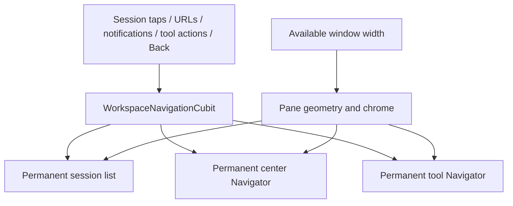

# Adaptive Workspace: navigation and state ownership

Updated: 2026-09-22

## Contract

The workspace adapts to **available window width**, without changing the identity
or lifetime of the user's current work. Crossing a breakpoint is a presentation
change, not a navigation action. It must not reconnect a session, reload history,
recreate a composer, discard an attachment, close a tool, or reset a reading anchor.

The same contract applies to phones, foldable devices, tablets, and desktop window
resizing. There is no device-model or orientation-specific navigation tree.

## Ownership

| Owner | State | Lifetime |
| --- | --- | --- |
| `WorkspaceNavigationCubit` | Selected session entry, current live session ID, tool entry, center overlay, compact foreground | Workspace |
| Session screen / session Cubit | Conversation, pending creation, stream subscriptions, permissions and provider state | Selected session entry |
| Composer and hooks | Text, selection/composition, attachments/sketches, focus and completion overlays | Session screen |
| `ChatMessageList` / scroll controller | Visible-message anchor, latest/history reading mode, scroll state | Session screen |
| Tool screen / tool Cubit | Explorer location, Git mode/selection/scroll, gallery position | Tool entry |
| Session list | Search input, scroll, filters and expansion | Workspace |
| `DraftService` and existing caches | Durable drafts and session-specific navigation snapshots | Their existing service lifetimes |

Layout width is not a field of navigation state. Session entry identity is a local
monotonic generation, independent of the Bridge session ID. Pending creation,
clear-context and rewind can change the live ID without replacing the entry.
The original selection remains the screen's construction input; subsequent live
state belongs to the screen, not a new constructor invocation on each resize.

A user explicitly choosing a different session creates a new entry. Drafts and
existing per-session tool snapshots retain their usual persistence behavior. This
is not an unbounded cache of every chat widget ever opened. Explicit close,
selected-session stop and disconnect release the corresponding work. Process
restart recovery remains the responsibility of the existing draft/cache services.

## Navigation projection

The center Navigator contains an empty root, the selected conversation page, and
an optional settings/gallery/setup page. The tool Navigator contains an empty
root and the current tool page. Both Navigators remain siblings in the same
Stack, with stable keys, across all widths. Center overlays add a page above the
conversation; they do not replace its subtree.

Below **862 logical pixels of usable width**, the panes occupy the full window;
the last navigation intent or pane interaction chooses the foreground. At and above 862, the list
and center are visible together, with an optional right tool pane. Minimum usable
widths are 260 for the list, 360 for the center, and 240 for the tool, plus dividers.
The user's preferred tool width is retained when temporary window constraints
clamp its displayed width.

Horizontal safe-area insets are excluded from the breakpoint calculation and
allocated only to panes touching the physical window edge. Interior panes remove
those insets. Compact routes keep the full-window surface and native edge gesture.
A hidden pane never receives a zero-width layout.

## Back, focus, and visibility

Compact iOS pages use Cupertino routes, including interactive Back completion and
cancellation. Android and desktop use themed Material routes, retaining Android
predictive-back support. Their transparent root content reveals the actual destination
underneath. Retained tools behind a foreground conversation are not painted, so
a conversation-to-list swipe never previews a tool that will disappear on pop.
Expanded routes have no pane-to-pane slide animation. Existing route animation
controllers are updated when compactness changes, including routes created wide.
Each Navigator owns its own Hero controller.

Only the foreground compact pane accepts input, focus and accessibility traversal.
Expanded panes remain interactive. `NavigatorPopHandler` delegates system Back to
one current logical destination, including on tablets. Page removal and delayed
page callbacks carry entry identity; obsolete work must not close or update a
newer destination. Focus nodes and editing controllers stay owned by their screens. A returning
compact pane restores its previously focused control, while merely revealing a
side pane on expansion does not steal focus.

Notification suppression follows the **visible live conversation**, including
root-route visibility, rather than a nested route's `isCurrent` flag alone.
Suppression has an owner token so disposal of an old workspace cannot clear a
new owner's session. List highlighting uses the live selected ID independently
of notification suppression.

## External entry points and asynchronous creation

`SessionRouteRegistry` registers the workspace's root route, live identity and
open/reveal commands. `SessionStackNavigation` first reuses that workspace.
Legacy `ClaudeSessionRoute` / `CodexSessionRoute` and their URL paths remain
compatible; their screens now adapt the request into workspace navigation.
With no existing workspace, the adapter creates `AdaptiveHomeRoute` with an initial
selection, leaving a real session-list Back destination. Resolved session links
use the same path, including cold starts.

The always-mounted session list must not interpret a pending screen's creation
event as a second navigation. It still buffers events for the original list-start
race, while directly linked pending screens resolve their own matching event.
Creation failure returns through the entry's Back callback, not an unrelated
root router. Git/explorer result delivery and snapshots use the **live** session
ID, including immediately after pending creation.

## Reading position

Keeping a pixel offset is insufficient when text reflows. The chat list measures
a keyed visible message after layout and after scrolling. Before viewport
constraints change, it uses the last stable measurement, then corrects the anchor
during the viewport's layout pass, before painting. It does not read unrelated
RenderBox sizes during layout. The existing streaming anchor and latest-message
behavior remain in place. Active user scrolling and explicit scroll-to-message
actions take precedence over automatic correction.

The guarantee is a measured visible-message anchor; arbitrary character-level
position within a single reflowing rich-text message is not a separate persisted
navigation state.

## Verification

Regression coverage includes:

- Real conversation Cubit/controller identity, unsent text, selection, attachments,
  focus and settings overlays across 430 / 861 / 862 / 1400 pixel widths.
- Claude and Codex pending resolution, live-ID stop, creation failure and tool
  retention across compact/expanded transitions.
- Native swipe completion/cancellation, resizing during a gesture, wide-created
  routes returning with compact animations, and system Back in both layouts.
- Direct routes, cold entry, root overlays and revealing the same live ID without
  duplicating or replacing the conversation.
- First-frame message anchoring during width reflow and streamed updates.
- Session-list scroll position across 861 / 862, safe-area-aware pane sizing,
  and tool pop paint order while composer focus is restored.

Validation on 2026-09-22: the complete Flutter suite passed (1,856 tests, four
skipped); analysis reported no errors or warnings (42 existing informational
lints). The final iOS simulator debug build passed with Xcode 27. Independent
navigation/state review completed with no outstanding findings.

Runtime verification uses the installed iOS 27 SDK and a separate localhost
Bridge on port 8766. iPhone portrait/landscape checks covered safe-area sizing,
tool navigation and retained composer state. On iPad mini, the final build
retained the same composer controller and restored its focus after closing Git;
its draft also survived app restart. A real Codex round-trip returned
`ADAPTIVE_STATE_OK` after the tool transition, with no runtime layout errors. Actual iPad rotation could not be automated:
iPad multitasking ignores the app orientation request, and Device Hub's desktop
accessibility interface timed out. Compact/expanded transitions, including their
first frame, are covered by the automated widget tests above. iPhone Duo-specific reserved-region geometry is a separate
platform integration: the installed Xcode 27.0 does not contain its simulator.
This design does not depend on that simulator or invent hinge geometry.

## References

- [Flutter adaptive/responsive best practices](https://docs.flutter.dev/ui/adaptive-responsive/best-practices)
- [Apple: Design for iPhone Duo](https://developer.apple.com/videos/play/tech-talks/111466/)
- [Apple: Prepare your app for iPhone Duo](https://developer.apple.com/documentation/technologyoverviews/preparing-your-app-for-iphone-duo)
- [Flutter NavigatorPopHandler](https://api.flutter.dev/flutter/widgets/NavigatorPopHandler-class.html)
- [Flutter Navigator.onDidRemovePage](https://api.flutter.dev/flutter/widgets/Navigator/onDidRemovePage.html)
